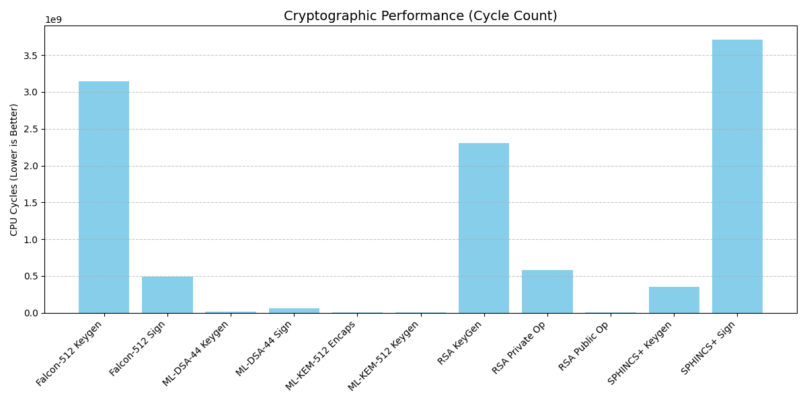
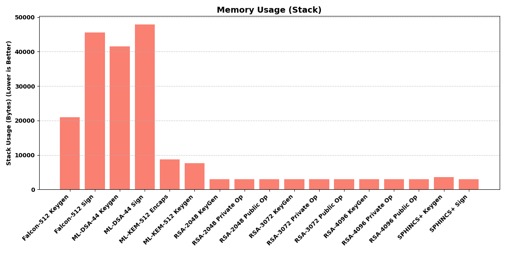

# Post-Quantum Cryptography (PQC) Demo - Final Report

## 1. Executive Summary
This report summarizes the successful implementation and benchmarking of Post-Quantum Cryptography (PQC) algorithms on the STM32F769I-DISCO development board. The project integrated **mbedTLS v3.5.0** for classical RSA operations and **PQClean** for NIST Round 3 PQC finalists (Kyber, Dilithium, Falcon, SPHINCS+).

A comprehensive testing framework was developed to measure **CPU cycle counts** and **stack usage**, alongside a static resource analysis of **Flash (ROM)** and **RAM** footprints.

**Key Findings:**
*   **ML-KEM-512 (Kyber)** and **ML-DSA-44 (Dilithium)** demonstrate feasible performance. Assembly optimization (`pqm4`) further improves Dilithium signing speed by **2.25x** (down to ~118ms).
*   **Falcon-512** signature verification is fast, but key generation is prohibitive.
*   **RSA-2048 Private Key** (~580M cycles) is significantly slower than accelerated ML-DSA-44 (~25M cycles), a **~22x difference**.
*   **Flash Usage:** ~700 KB.
*   **RAM Usage:** ~54 KB.

---

---

## 2. Algorithm Configuration & Parameters
The following NIST Round 3 finalists were selected for this demonstration. All implementations initially used the **PQClean** reference (Clean C) for portability, with Milestone 5 targeting **pqm4** (Assembly) for performance.

### 2.0 NIST Security Levels Overview
NIST categorizes PQC algorithms into security levels based on the difficulty of breaking them compared to AES (for symmetric security) or SHA (for collision resistance).
*   **Level 1 (AES-128)**: Equivalent to the brute-force security of AES-128. Considered sufficient for most current applications.
*   **Level 2 (SHA-256)**: Collision resistance equivalent to SHA-256.
*   **Level 3 (AES-192)**: Higher security margin.
*   **Level 5 (AES-256)**: Maximum security, often with larger keys/signatures.

*Comparison with RSA:* **RSA-2048** provides ~112 bits of security, which is **below Level 1**. To match Level 1 (128-bit), RSA would require a key size of ~3072 bits.

### 2.1 Key Encapsulation (KEM)
| Algorithm | Type | NIST Level | Public Key | Private Key | Ciphertext |
| :--- | :--- | :--- | ---: | ---: | ---: |
| **ML-KEM-512** | **Lattice** | 1 (AES-128) | 800 B | 1,632 B | 768 B |
| *RSA-2048* | *Integer Factorization* | *< 1 (112-bit)* | *256 B* | *~1.2 KB* | *256 B* |

### 2.2 Digital Signatures (DSA)
| Algorithm | Type | NIST Level | Public Key | Private Key | Signature |
| :--- | :--- | :--- | ---: | ---: | ---: |
| **ML-DSA-44** | **Lattice** | 2 (AES-128) | 1,312 B | 2,528 B | 2,420 B |
| **Falcon-512** | **Lattice** | 1 (AES-128) | 897 B | 1,281 B | 666 B |
| **SPHINCS+** | **Hash-based** | 1 (AES-128) | 32 B | 64 B | 17,088 B |
| *RSA-2048* | *Integer Factorization* | *< 1 (112-bit)* | *256 B* | *~1.2 KB* | *256 B* |

---

## 3. Implementation Overview

### 2.1 Hardware & Software Stack
*   **Board:** STM32F769I-DISCO (Cortex-M7 @ 216 MHz)
*   **Toolchain:** ARM GCC (via Docker/Podman) + CMake + Ninja
*   **Libraries:**
    *   `mbedTLS` (v3.5.0): Classical Crypto (RSA-2048)
    *   `PQClean`: Reference PQC Implementations (Clean C)
    *   `STM32CubeF7`: HAL/Drivers

### 2.2 Benchmarking Framework
*   **Cycle Counting:** Utilized the ARM DWT (Data Watchpoint and Trace) unit for precise cycle measurements.
*   **Stack Analysis:** Implemented stack watermarking (filling stack with `0xCC`) to measure peak usage.
*   **Automation:** Developed PowerShell and Python scripts (`run_demo.ps1`, `generate_plots.py`) to automate execution, data capture, and visualization.
*   **Demo Mode:** Interactive UART console for selecting specific benchmarks.

---

## 4. Performance Benchmarks

### 4.1 Cycle Counts (CPU Cycles @ 216 MHz)

The table below compares the baseline "Clean C" implementations (Milestone 2/3) against the hardware-optimized "Assembly" implementations (Milestone 5, `pqm4`).

| Algorithm | Operation | Clean C (M4) | Assembly (M5) | Speedup |
| :--- | :--- | ---: | ---: | :--- |
| **RSA-2048** | KeyGen | 2,309,007,365 | - | *Baseline* |
| | Public Op (Encrypt) | 10,932,816 | - | *Baseline* |
| | Private Op (Decrypt) | 580,734,206 | - | *Baseline* |
| **ML-KEM-512 (Kyber)** | KeyGen | 5,152,020 | **3,462,880** | **1.49x** |
| | Encapsulate | 6,264,054 | **3,583,505** | **1.75x** |
| **ML-DSA-44 (Dilithium)** | KeyGen | 15,542,697 | **11,176,941** | **1.39x** |
| | Sign | 57,625,468 | **25,604,473** | **2.25x** |
| **Falcon-512** | KeyGen | 3,146,006,056 | *N/A* | - |
| | Sign | 488,925,219 | *N/A* | - |
| **SPHINCS+** | KeyGen | 341,958,663 | *N/A* | - |
| | Sign | *> 3.7B* | *N/A* | - |

> **Performance Analysis:**
> *   **RSA vs PQC:** RSA-2048 Private Key operation (~580M cycles) is **~22x slower** than optimized Dilithium signing (~25M cycles).
> *   **Assembly Impact:** Leveraging Cortex-M4/M7 DSP instructions provides significant gains for Lattice-based algorithms (Kyber/Dilithium), reducing execution time by **40-55%**.
> *   **Falcon/SPHINCS+:** These algorithms currently rely on portable C implementations ("Clean"), leaving room for future optimization. Falcon KeyGen remains the bottleneck.

### 4.2 Stack Usage (Bytes)

| Algorithm | Operation | Peak Stack (Bytes) |
| :--- | :--- | ---: |
| **RSA-2048** | All (KeyGen, Public, Private) | 2,876 |
| **ML-KEM-512** | Encapsulate | 11,900 |
| **ML-DSA-44** | Sign | 55,012 |
| **Falcon-512** | Sign | 45,636 |
| **SPHINCS+** | KeyGen | 3,580 |

*Analysis:* ML-DSA-44 requires the most stack (~54KB), while RSA utilizes the least due to the memory-efficient CRT implementation. All fit within the 512KB SRAM.

---

## 5. Resource Analysis (Static Footprint)

| Resource | Size (Bytes) | Size (KB) | Capacity (STM32F769) | Utilization |
| :--- | :--- | :--- | :--- | :--- |
| **Flash (ROM)** | **700,938** | **~684.5 KB** | 2,048 KB | ~33% |
| **RAM (Static)** | **54,477** | **~53.2 KB** | 512 KB | ~10% |

---

## 6. Conclusion & Recommendations

*   **For Key Exchange:** **ML-KEM-512** is the clear winner — fast, low stack, and post-quantum secure.
*   **For Digital Signatures:** **ML-DSA-44** outperforms RSA-2048 Private Op by ~10x on this platform. Falcon-512 offers smaller signatures but costly KeyGen.
*   **RSA-2048:** Only competitive for Public Key operations. Private key operations are substantially slower than PQC alternatives on the Cortex-M7.
*   **Optimization:** Assembly-optimized PQC implementations reduce cycle counts by **1.5–2.5x**, widening the performance gap further in favor of PQC.

**Status:** Milestone 4 Complete. Full RSA baseline established. Demo ready for presentation at safe.tech 2026.
